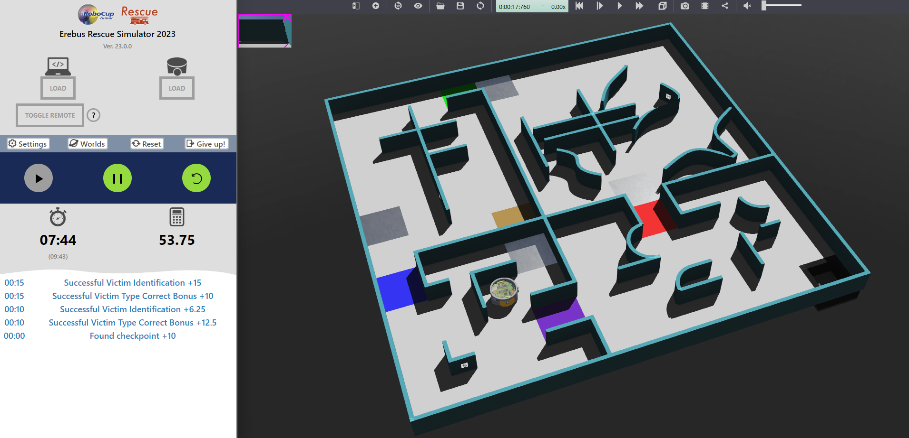
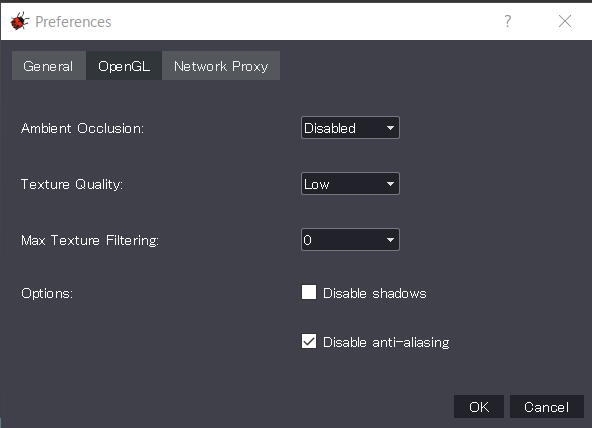
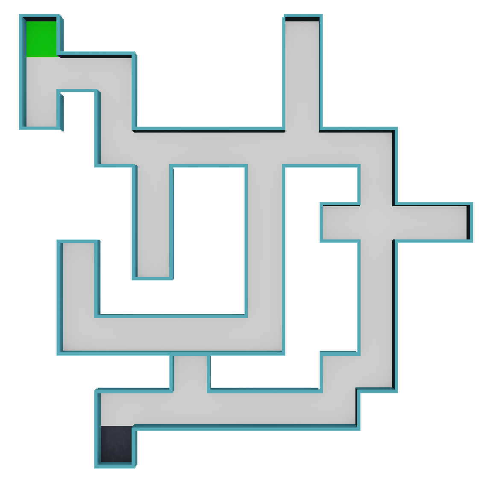
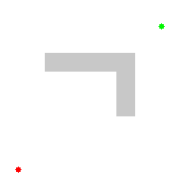

# Rescue Simulation


---

# About me

- Participated in Rescue Simulation (CoSpace) since 2016
- Bachelors in Computer Science @ University of Hertfordshire
- Joined the Humanoid Soccer League with Bold Hearts
- Masters Degree in Robotics and Intelligent Systems at University of Aveiro

---

# Introduction

The virtual robot is tasked with **exploring and mapping a maze** with different rooms and **identifying victims** on its way. The rule set for RCJ Rescue Simulation is similar to RCJ Rescue Maze and extended by adding new areas with more difficult terrain. Additionally, **some elements from RoboCup Rescue Major** are incorporated.

In 2022 it was run as a regular competition in Bangkok, Thailand.

---

# Simulator

<!--  -->

<!-- div with a 70-30 division -->
<div style="display: flex; flex-direction: row; justify-content: space-between; align-items: center;">
    <div style="width: 40%;">
        <p style="font-size:25px"> The simulator is a 2D environment with a robot and a map. The robot can move around the map and sense the environment. The robot can also communicate with other robots and the referee. 
        </p>
        <p style="font-size:25px"> 
        In 2020 changed from the closed-source CoSpace to <strong>Webots</strong> and <strong>Erebus</strong>.
        This allows for more complex and interesting challenges.
        </p>
        </div>
    <div style="width: 50%;">
        
    </div>
        
---
# Simulator


<!-- two div columns -->
<div style="display: flex; flex-direction: row; justify-content: space-between; align-items: center;">
    <div style="width: 50%;">
        More sensors:

<ul style="font-size:25px">
<li>
Camera (Mono | Stereo)
<li>
GPS
<li>
Gyro
<li>
IMU
<li>
Colour Sensors
<li>
Accelerometer
<li>
Lidar
<li>
Distance sensors
</ul>

</div>
<div style="width: 40%;">
<p>    
Easier transition between simulation and real leagues.
</p>
<p>    
More complex and flexible implementations.
</p>

<p style="font-size:30px">
Customization platform:
<a url="https://robot.erebus.rcj.cloud/">
https://robot.erebus.rcj.cloud/
</a>
</p>
</div>
</div>

---

# Webots - Introduction

**Open-source** 3D robot simulator.

It supports python, C++ and Matlab. But anything can be used using the API throw external controllers and wrappers.

Developing software for robots is mostly done using simulation due to **safety and cost concerns**.

You can experiment with **different robot designs**, sensors, and actuators to see how they work.

**Widely used by teams in RoboCup Major leagues** for Simulation leagues and internal development.

<!-- Quicly introduce webots and it's potential -->
<!-- Mention how most robocup teams use ROS2 with webots through external controllers -->

---

# Erebus

Erebus is a Supervisor for Webots that creates an **interface between the teams and the simulator**. It is in charge of **scoring**, **lack of progress**, **robot controllers**, **robot customization**, and more.


---

# Installation

<!-- Ask if everyone has it installed -->
## Webots
<a url="https://cyberbotics.com/">
https://cyberbotics.com/
</a>

## Erebus
<a url="https://gitlab.com/rcj-rescue-tc/erebus/erebus/-/releases">
https://gitlab.com/rcj-rescue-tc/erebus/erebus/-/releases
</a>

## Python 3.9 or later
<a url="https://www.python.org/downloads/">
https://www.python.org/downloads/
</a>

---

# Suggested Graphics settings

- Ambient Occlusion: Disabled
- Texture Quality: Low
- Max Texture Filtering: 0
- Options:
  - Disable shadows: 🔲
  - Disable anti-aliasing: ✔️



---
<!-- _class: points -->

# How to make points

* **Identifying victims**
  - **5 points** - located on a tile adjacent to a linear wall 
  - **15 points** - other walls
  - **+10 points** - if the corrected type is reported
* **Identifying hazard signs**
  - **10 points** - located on a tile adjacent to a linear wall
  - **30 points** - other walls
  - **+20 points** - if the corrected type is reported
* **Mapping the map** - Multiplier between 1 and 2
* **Finding a checkpoint** - 10 points
* **Successful Exit Bonus** - 10% of total score as an exit bonus if at least one
victim has been identified
* **Area multipliers** - The multipliers are 1, 1.25, and 1.5 for areas 1, 2, and 3 respectively.

---
# How to lose points

* Miss identifying victims - **-5 points**
* Lack of progress - **-5 points**


---
# Victims and Hazard Signs
<!-- make images side by side -->
<div style="display: flex; flex-direction: row; justify-content: left; align-items: center;">
    <div style="width: 30%;">
        
    </div>
    <div style="width: 40%;">
        
    </div>
</div>

<div style="display: flex; flex-direction: row; justify-content: left; align-items: center;">
<ul>
<li>
  Harmed victim (H)
<li>
  Stable victim (S)
<li>
 Unharmed victim (U)
</ul>

<ul>
<li>
  Flammable Gas (F)
<li>
Poison (P)
<li>
Corrosive (C)
<li>
Organic Peroxide (O)
</ul>
</div>

---

# Rules for mapping

<!-- two column markdown table -->
| **Type** | **Identifier** |
| --- | --- |
| Walls | 1 |
| Holes | 2 |
| Swamps | 3 |
| Checkpoints | 4 |
| Starting tile | 5 |
|Connection tiles from area 1 to 2	| 6 |
|Connection tiles from area 2 to 3	| 7 |
|Connection tiles from area 3 to 4	| 8 |
|Connection tiles from area 1 to 4	| 9 |
|Victims| The corresponding victim code (H,S,U,F,P,C,O)|
|All area 4 tiles/edges/vertices | Any character (*) |
|Any other tiles/edges/vertices	|   0 |

---
# Rules for mapping

- For curved walls in area 3, the vertex should be represented by a ‘0’.
- The presence of a victim should be marked on the cell that represents the corresponding wall. If more than one victim is on a wall, the entry should be concatenated.
- Victims in full tiles (non-quarter tiles) will be skewed horizontally/vertically. They should be placed in whichever quarter tile they are skewed closer to.
- Maps can be stored in any rotation as long as it is a multiple of 90°


---

# Victims - emitting

The following conditions must be fulfilled in order to receive the score of the victim.
* **The robot must remain stationary** for at least **1 second**. No turning. STOP!
* After that, the robot must **send a message by emitter**.
* The error between the coordinates of the "expected point" in the message and the coordinates of the correct victim must be within a certain range. (Should be 9cm)
* The error between the coordinates of the centre of the robot and the coordinates of the victim of the correct answer must be within a certain range(same as above).

---

# Checkpoints

If the robot is stuck, pressing the restart button will trigger a lack of progress to relocate the robot to the last reached checkpoint.

---

# Programming the robot 
## Initial setup
<!-- python code with syntax hghligthing-->

```python
from controller import Robot

timeStep = 32            # Set the time step for the simulation
max_velocity = 6.28      # Set a maximum velocity time constant

# Make robot controller instance
robot = Robot()
```
---

# Programming the robot 
## Actuators


```python
# Define the wheels 
wheel1 = robot.getDevice("wheel1 motor")   # Create an object to control the left wheel
wheel2 = robot.getDevice("wheel2 motor") # Create an object to control the right wheel

# Set the wheels to have infinite rotation 
wheel1.setPosition(float("inf"))       
wheel2.setPosition(float("inf"))
```


---
# Programming the robot 
## Sensors

```python
s1 = robot.getDevice("ps5")
s2 = robot.getDevice("ps7")
s3 = robot.getDevice("ps0")
s4 = robot.getDevice("ps2")

#enable the sensors
s1.enable(timeStep)
s2.enable(timeStep)
s3.enable(timeStep)
s4.enable(timeStep)
```
---

# Programming the robot 
## Main loop

```python
start = robot.getTime()
while robot.step(timeStep) != -1:

    # pre-set each wheel velocity
    speed1 = max_velocity
    speed2 = max_velocity

    # Very simple (but also poor) strategy to demonstrate simple motion
    if s1.getValue() < 0.1:
        speed2 = max_velocity/2
    
    if s4.getValue() < 0.1:
        speed1 = max_velocity/2
    
    if s2.getValue() < 0.1:
            speed1 = max_velocity
            speed2 = -max_velocity
        
    # Set the wheel velocity 
    wheel1.setVelocity(speed1)              
    wheel2.setVelocity(speed2)
```
---

# Running the simulator
<!-- start maybe on a more pratical here and ask them to open the simulator and run something -->
<!-- maybe develop a challenge  -->
<!-- create a maze? whoever gets to the end faster wins -->
1. Open the Maze-FNR2023 world
2. Open the Robot Window
3. Load example controller
4. Make the robot reach the end of the maze as fast as possible!



---

# Maze solving techniques
  * Right-then-Left navigation
  * Left-then-Right navigation
  * Wall following
  * **Mapping and path planning**
  * ~~Hardcoding~~



---
# Mapping

- Sonar sensors
- Lidar
- Camera

Using Lidar and generating a cloud of points to apply SLAM.

```python
self.lidar = self.robot.getDevice("lidar")
lidar.enable(timeStep)
lidar.enablePointCloud()
```
<div class="slam">
<span>S</span>imultaneous<span>L</span>ocalization<span>A</span>nd<span>M</span>apping
</div>

---
# SLAM

A robot is exploring an unknown environment.
## Given
- The robots controls
- Observations of the nearby environment(Features)

## Estimate
- Map of the environment(Features)
- Path of the robot

---

# Techniques

- **Extended Kalman Filter**
- Scan matching
- FastSLAM
- GraphSLAM
- gMapping
- Hector Mapping

---

# Detecting Victims

Pre-built solutions such as:
  * Tesseract 
  * EasyOCR
  * Vision models (YOLO etc.)
<strong>
<p style="color:white; text-align:center; font-size:40px;">
Pre-built solutions to any primary task are prohitibted
</p>
</strong>

---
# Detecting Victims

Pre-built solutions such as:
  - ~~Tesseract~~
  - ~~EasyOCR~~
  - ~~Vision models (YOLO etc.)~~

<!-- align to center -->

<strong>
<p style="color:red; text-align:center; font-size:40px;">
Pre-built solutions to any primary task are prohitibted
</p>
</strong>

---
# How can we detect victims?

<!--  -->


<div style="display: flex; flex-direction: row; justify-content: center; align-items: center;">
<div style="width: 50%;">

<div>
</div>
<!-- Explain git controll and help them using the interface -->

---
# Git control
## Instalation

- CLI
- **GUI - Github Desktop** | https://desktop.github.com/


---

# Git control
## Create an SSH key

```
> $ ssh-keygen
Generating public/private rsa key pair.
Enter file in which to save the key (/Users/user/.ssh/id_rsa): [press enter]
Enter passphrase (empty for no passphrase): [press enter]
```
Retrieve public key

## Mac and Linux
```
cat /Users/user/.ssh/id_ed25519.pub
```

## Windows
- Go to C:\Users\your_username/.ssh.
- Open id_rsa.pub in a text editor.
---

# Git control
## How it works - branches


<!-- explain how branches work -->

---
# Git control
## Creating a repository 

### Initiate git
```bash
git init
```

### Add a remote origin
```bash
git remote add origin https://github.com/octocat/Spoon-Knife.git
```
---
# Git control
## Adding files/changes
```
git add file
```
## Commiting the changes
<p class="explanation">
In Git, a commit is a snapshot of your repo at a specific point in time.
</p>

```
git commit -m "commit message" [replace with changes title]
```
## Push to the remote repository
```
git push
```
---
# Git control
## Retrieving updates from remote
```
git pull
```
---
# Git control
## Creating a branch
```
git checkout -b feature_name
```
## Changing branch
```
git checkout branch_name
```
---

# Git control
## Pull requests

After a feature is finished being developed a Pull request (PR) should be created to merge the two branches, applying the changes.

- Go to the branch 
- Select "contribute"
- Select "Open pull request"
<br>
<br>


---
# Git control
## Merging
After the PR is open it is good practice for another developer to test it and  approve it before being merged

When merging, conflicts might be detected and you might have to fix parts of the code manually.

